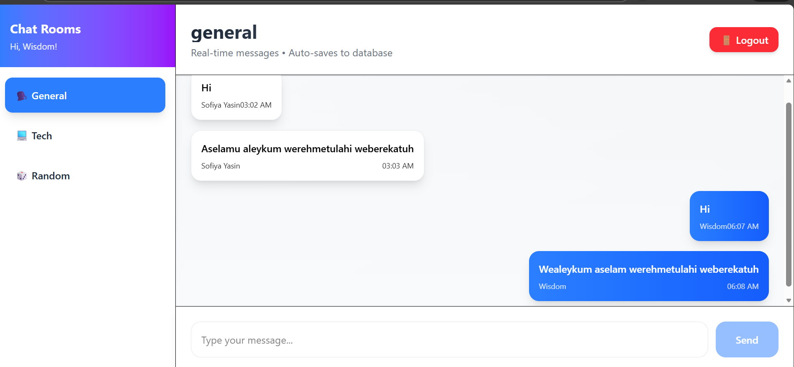
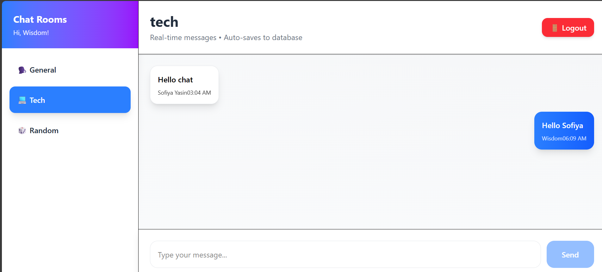

# Chat App

A MERN chat app with JWT auth and room-based messaging.

## Features

- Register/login with JWT
- Room-based chat (general, tech, random)
- MongoDB persistence
- Socket.io ready (client included)

## Tech Stack

- Backend: Node.js, Express, MongoDB (Mongoose), JWT, bcrypt
- Frontend: React (Vite), Tailwind, Axios, React Router

## Screenshots




## Prerequisites

- Node.js 18+
- MongoDB connection string

## Setup

### 1) Backend

```bash
cd chat-app/backend
npm install
```

Create a `.env` file in `chat-app/backend`:

```env
MONGODB_URI=your_mongodb_connection_string
JWT_SECRET=your_jwt_secret
```

Start the server:

```bash
npm run dev
```

The API runs on `http://localhost:5000`.

### 2) Frontend

```bash
cd chat-app/frontend
npm install
npm run dev
```
