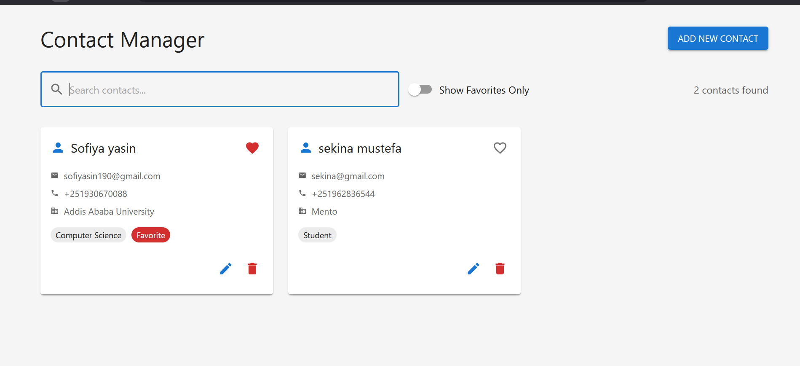

# Contact Manager

A full-stack Contact Management application with CRUD operations built using React, Node.js/Express, and MongoDB.

**Developer**: Sofiya Yasin  
**Email**: sofiyasin190@gmail.com  
**GitHub**: [sofi3406](https://github.com/sofi3406)  
**Phone**: +251 930 670088

   🚀 Features
Frontend (React)
User Interface: Modern, responsive design with Material-UI

Contact Management:

View all contacts in a grid layout

Search contacts by name, email, or phone

Filter favorites

Pagination support

CRUD Operations:

Create new contacts with form validation

Edit existing contacts

Delete contacts with confirmation

Toggle favorite status

Form Validation: Client-side validation using react-hook-form and yup

Real-time Updates: Instant feedback with toast notifications

Backend (Node.js/Express)
RESTful API: Full CRUD endpoints for contacts

Database: MongoDB with Mongoose ODM

Validation: Server-side validation with express-validator

Error Handling: Comprehensive error handling middleware

Pagination & Filtering: Support for search, pagination, and filtering

CORS Enabled: Cross-origin resource sharing

📋 Prerequisites
Node.js (v14 or higher)

MongoDB (v4.4 or higher)

npm or yarn package manager

  📁 Project Structure

contact-manager/
├── backend/
│   ├── src/
│   │   ├── config/          # Configuration files
│   │   ├── controllers/     # Route controllers
│   │   ├── models/          # MongoDB schemas
│   │   ├── routes/          # API routes
│   │   ├── middleware/      # Custom middleware
│   │   └── utils/           # Utility functions
│   ├── .env                 # Environment variables
│   ├── package.json         # Backend dependencies
│   └── server.js           # Entry point
└── frontend/
    ├── src/
    │   ├── components/      # React components
    │   │   ├── ContactList.js
    │   │   └── ContactForm.js
    │   ├── services/        # API service layer
    │   │   └── api.js
    │   ├── utils/           # Utility functions
    │   ├── App.js           # Main App component
    │   └── index.js         # Entry point
    ├── package.json         # Frontend dependencies
    └── public/              # Static files

    🗂️ API Endpoints
Method	Endpoint	Description
GET	/api/contacts	Get all contacts (with pagination)
GET	/api/contacts/:id	Get single contact
POST	/api/contacts	Create new contact
PUT	/api/contacts/:id	Update contact
DELETE	/api/contacts/:id	Delete contact
PATCH	/api/contacts/:id/favorite	Toggle favorite status
GET	/api/test	Test API connection
Query Parameters
page: Page number (default: 1)

limit: Items per page (default: 10)

search: Search term (name, email, phone)

favorite: Filter favorites (true/false)

📱 Contact Schema

{
  firstName: String,      // Required, min 2 characters
  lastName: String,       // Required, min 2 characters
  email: String,          // Required, valid email format
  phone: String,          // Required, valid phone format
  address: {
    street: String,
    city: String,
    state: String,
    zipCode: String,
    country: String
  },
  company: String,
  jobTitle: String,
  notes: String,          // Max 500 characters
  isFavorite: Boolean,    // Default: false
  createdAt: Date,
  updatedAt: Date
}

🎨 Frontend Features

Components
ContactList: Main component displaying all contacts

Search and filter functionality

Grid layout with Material-UI cards

Pagination support

Action buttons (Edit, Delete, Favorite)

ContactForm: Modal form for creating/editing contacts

Form validation with yup schema

Material-UI form controls

Address field group

Character counter for notes

Services
api.js: Axios-based API service

Request/response interceptors

Error handling

All CRUD operations