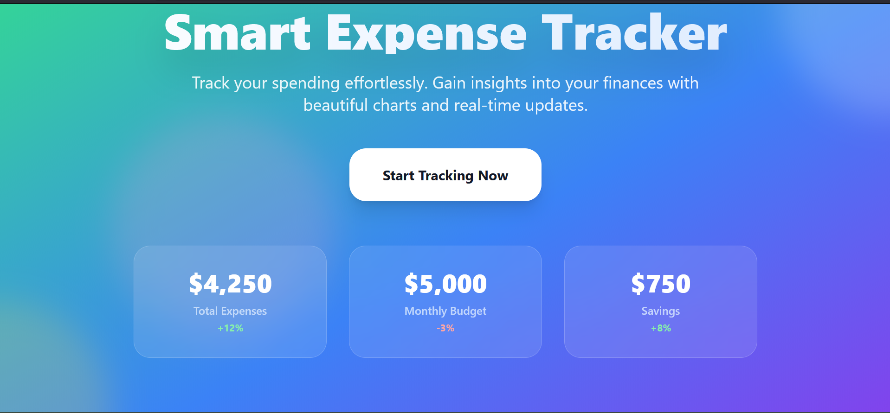
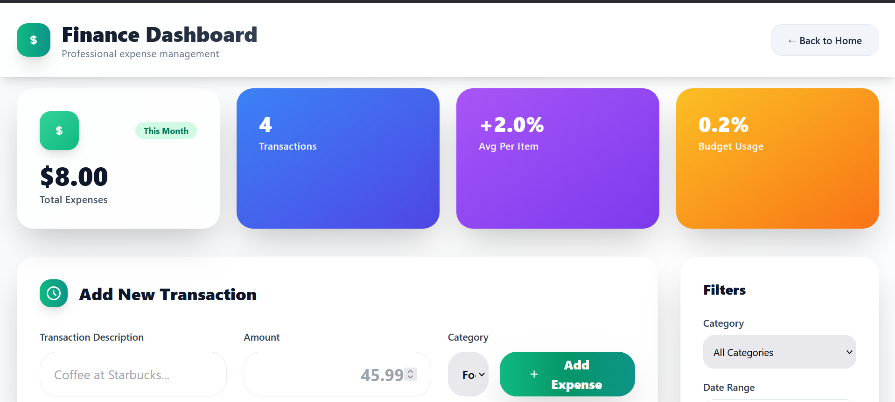
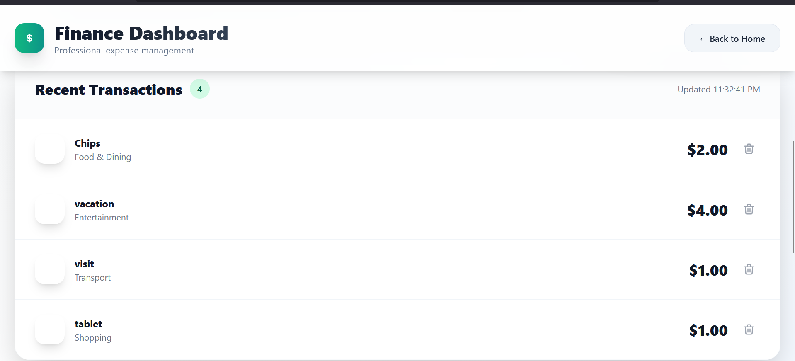

Finance Dashboard 🚀
A professional, responsive expense tracker built with React 18 + Vite + TailwindCSS. Features beautiful landing page, advanced dashboard, and all modern React hooks.

✨ Features
🎨 Beautiful Landing Page - Gradient hero with animated stats & features

📊 Professional Dashboard - KPI cards, filters, real-time totals

⚡ All React Hooks - useState, useEffect, useRef, useMemo, useCallback

📱 Fully Responsive - Mobile-first design with perfect breakpoints

🎯 Clean State Management - No random data, user adds real expenses

💎 Enterprise Design - Glassmorphism, neumorphism, micro-interactions

🛠️ Tech Stack
React 18 + Vite + TailwindCSS 3.4
ES6+ Modules • Custom Hooks • Flexbox Grid

expense-tracker/
├── public/
├── src/
│   ├── components/
│   │   ├── LandingPage.jsx     # Hero landing
│   │   ├── Footer.jsx          # Professional footer
│   │   ├── ExpenseForm.jsx     # Add expenses
│   │   ├── ExpenseList.jsx     # Transaction list
│   │   └── ExpenseItem.jsx     # Individual items
│   ├── App.jsx                 # Main app + state
│   ├── main.jsx
│   └── index.css              # Tailwind + animations
├── tailwind.config.js
├── vite.config.js
└── package.json

## 🎨 Screenshots

| Landing Page | Dashboard | Transaction |
|--------------|-----------|-------------|
|  |  |  |

